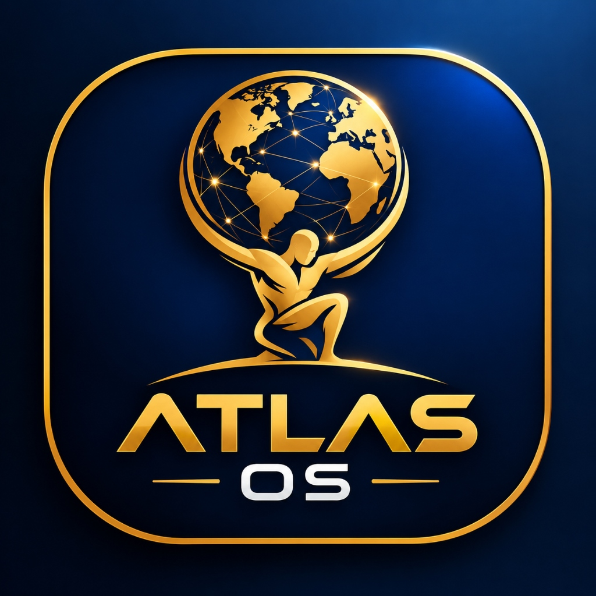

<div align="center">


# 🌌 ATLAS-OS (Titan Edition)
### Next-Generation Linux-Grade Operating System & Developer Suite for Mobile

[](https://bd.linkedin.com/in/nafiul-ahmad-rafi) [](https://bd.linkedin.com/in/nafiul-ahmad-rafi) [](LICENSE) [](SECURITY.md)

<p align="center"><b>Conceived, Architected & Authored by Nafiul Ahmad Rafi</b><br><i>Director, Atlas AI Institute | AI Policy and Governance Researcher | Civic Tech Architect</i><br><a href="mailto:rafi@atlasai.institute">rafi@atlasai.institute</a> • <a href="https://bd.linkedin.com/in/nafiul-ahmad-rafi">LinkedIn Profile</a></p>

[📥 Download APK](https://github.com/rafinafiulahmad/Atlas-OS---A-Linux-Operating-System-for-Mobile-/releases) • [📖 User Guide](#-hands-on-user-guide) • [🛠️ Build from Source](#️-build-from-source)

</div>

---

## 🏛️ Executive Leadership & Vision
**ATLAS-OS** represents a paradigm leap in civic technology and mobile edge compute. Architected under the direct research vision of **Nafiul Ahmad Rafi**, ATLAS-OS transforms Android smartphones into an industrial-grade Linux terminal, localized web server, and asynchronous hardware telemetry workstation.

---

## ⚡ Core Capabilities (Titan 11-in-1 Suite)
- 🌐 **Local Web Server**: Native HTTP daemon bound to port 8080 for cross-device file sharing.
- ⌨️ **Hacker Keybar**: On-screen tactile row with TAB, ESC, CTRL, Pipe, and Linux shortcuts.
- 💓 **Real-Time Hardware Pulse**: 2-second background telemetry monitoring RAM, CPU, and thermals.
- 📶 **Network Ping Diagnostics**: Live socket ping test to Google DNS (8.8.8.8) in ms.
- 🌓 **Dynamic Theme Matrix**: Instant toggle between True AMOLED Dark Mode and Paper Light Theme.
- ⚡ **Linux Process Matrix**: Process discovery with PID inspection and kill signals.
- 🔬 **Sensors & Display Telemetry**: Hardware detection of 120Hz refresh rate, DPI scale, and gyroscope.
- 📁 **Rapid Code Scaffold & Packager**: Starter templates for Python, Node.js, C++ and 1-click ZIP exporter.

---

## 📥 Quick Installation
1. Download ATLAS-OS.apk from the Releases section.
2. Tap the APK file and enable Install from Unknown Sources.
3. Launch ATLAS-OS!

## 🛠️ Build from Source
```bash
git clone https://github.com/rafinafiulahmad/Atlas-OS---A-Linux-Operating-System-for-Mobile-.git
cd Atlas-OS---A-Linux-Operating-System-for-Mobile-
./gradlew assembleDebug
```

## 🔒 Intellectual Property Notice
Copyright (c) 2026 Nafiul Ahmad Rafi. All Rights Reserved. Atlas AI Institute.
Licensed under GNU GPL v3.0. Complete attribution required.
